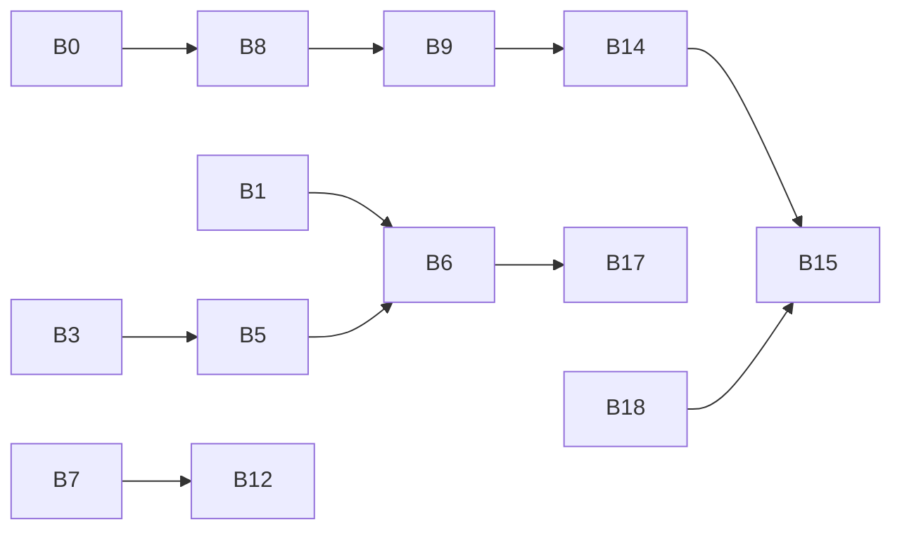

# Matriz de verificação — backlog × método de prova

Legenda:

- **S** — `verify-static-harness.mjs` + inspeção de arquivos
- **T** — teste automatizado (unit/integration)
- **M** — verificação manual / checklist
- **E** — E2E (Playwright ou equivalente)
- **B** — `npm run build` / smoke de produção

Cada linha referencia o backlog em `v2 copy.md`.

## Baseline e runtime

| ID | Item | Prova principal | Notas |
|----|------|-----------------|-------|
| B0 | Baseline dos 3 cases + HTML legado | S + M | Tabela `documentSlug → publicPath` fechada em `routing-manifest.mjs` |
| B1 | Sidecar Next dev-only + `npm start` | S + M | Portas 1234 / 3001 (ou fallback documentado) |
| B2 | UI real do editor (private-work, PT, iframe) | M + E | Paridade com editor original |
| B3 | Conteúdo `content/work/<slug>/index.mdx` | S + T | IDs `<slug>/index.mdx` |
| B4 | Frontmatter normalizado | T + M | Ver `contracts/work-frontmatter.schema.json` |

## Adapter e APIs

| ID | Item | Prova principal | Notas |
|----|------|-----------------|-------|
| B5 | Loader read/write + wire format | T + M | Imagem base por `workFileId` |
| B6 | `/api/editor/work` completo | T | GET lista, GET id, POST save, POST create |
| B7 | `/api/editor/drafts` | T | GET/POST/DELETE + bootstrap |
| B8 | Manifesto editorial vs público | S + T | `documentId` ≠ `publicPath`; helpers |

## Templates e preview

| ID | Item | Prova principal | Notas |
|----|------|-----------------|-------|
| B9 | Adapter Farfetch | T + `B18` | Shell + slots + `data-editor-*` |
| B10 | Adapter Dating | T + `B18` | Idem |
| B11 | Adapter Journal Finder | T + `B18` + M | Preview sem senha; público com senha |
| B12 | Preview `/editor/preview/work/[slug]` | M + E | postMessage; `REQUEST_REFRESH` quando exigido |
| B13 | Outline ↔ DOM | E | IDs estáveis vs `splitMdxSections` |

## Build e cutover

| ID | Item | Prova principal | Notas |
|----|------|-----------------|-------|
| B14 | `build-content` via adapters fiéis | B + T | Sem heurística para cases gerenciados |
| B15 | Cutover controlado | M + B | Rollback documentado |
| B16 | Produção sem sidecar | B | Único comando de deploy do site |
| B17 | Testes de contrato | T | APIs + manifest + migração |
| B18 | Paridade estrutural HTML | T | Normalização em `contracts/` ou doc de teste |
| B19 | E2E editor work | E | Fluxo completo da lista de cenários |
| B20 | Documentação operacional | M | Portas, rotas, draft, auth, rollback |

## Fase 2 — `pages`

| ID | Item | Prova principal |
|----|------|-----------------|
| P1 | `content/pages/<slug>/index.mdx` | S + T |
| P2 | `/api/editor/pages` | T |
| P3 | Templates fiéis (about, home opcional) | T + B18 |
| P4 | E2E + cutover | E + B |

## Dependências entre provas

